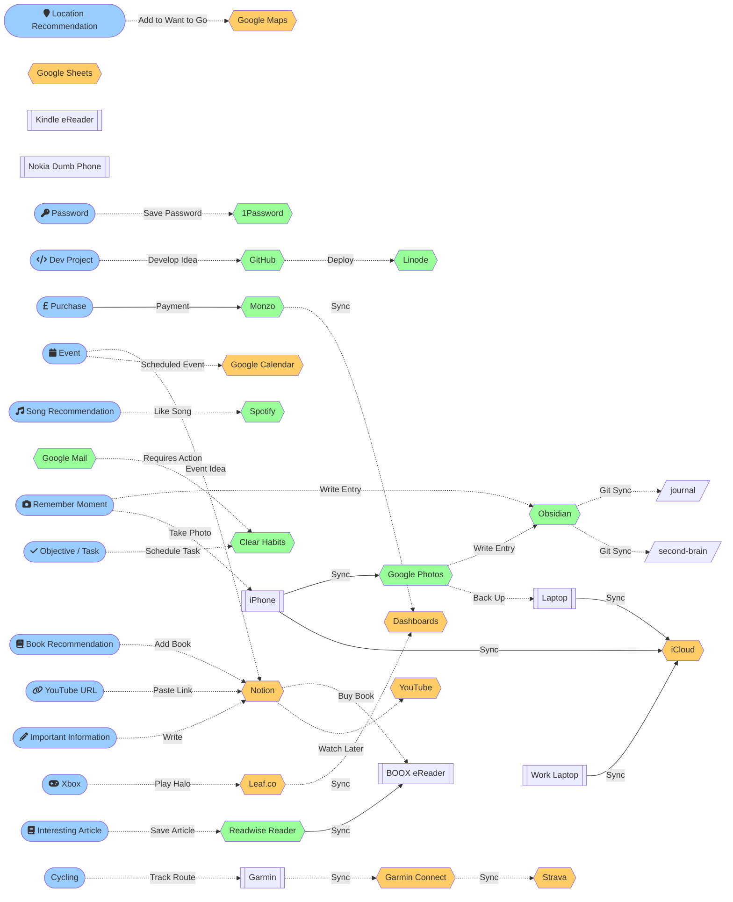
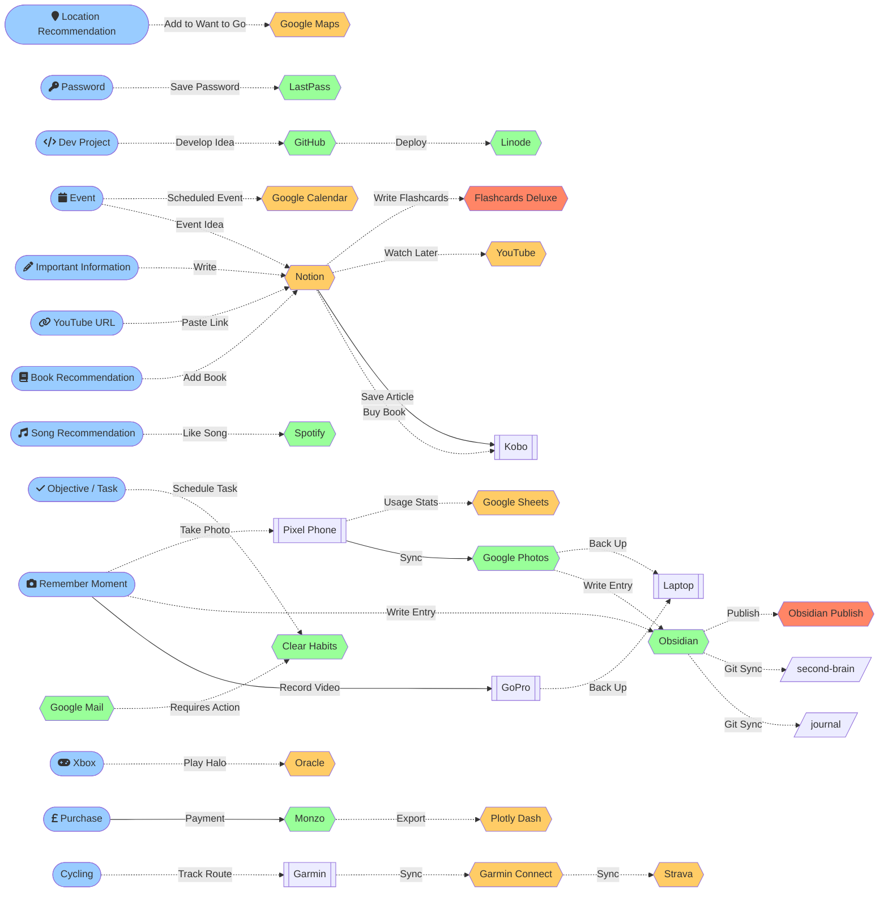
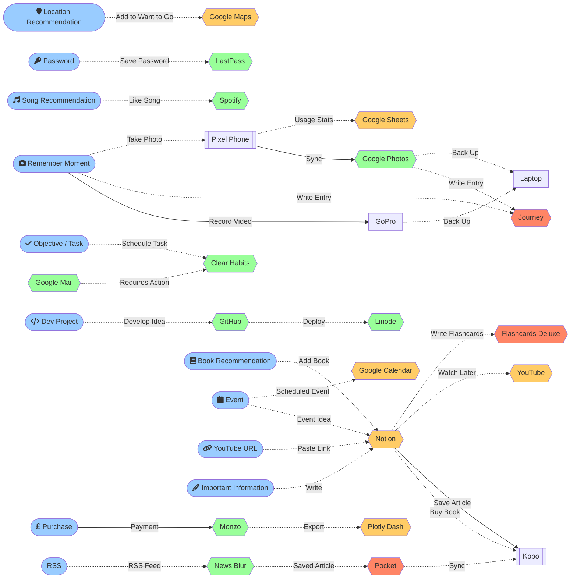
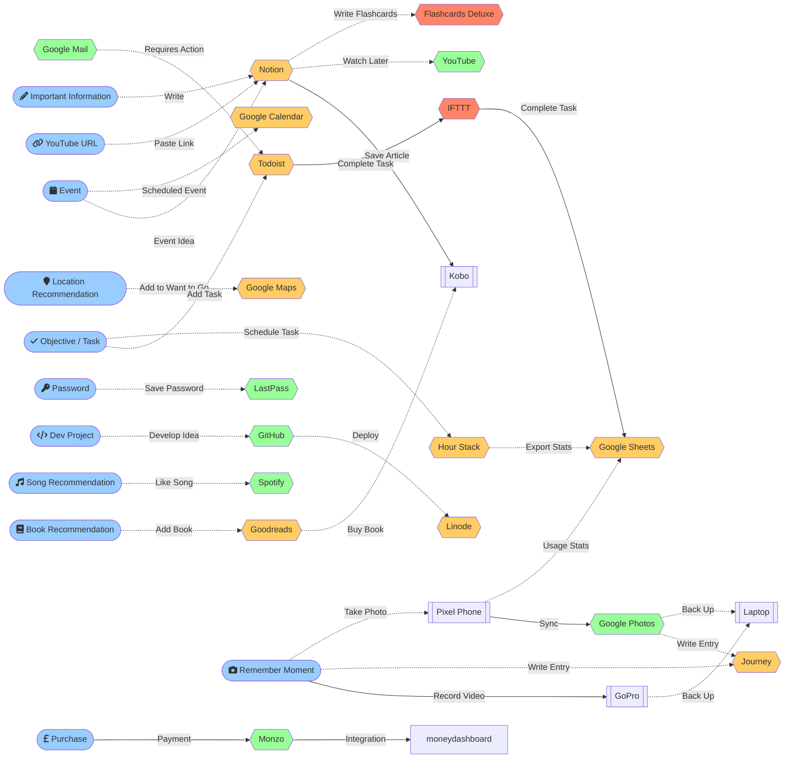

The following file details the various processes that I regularly undergo to complete particular tasks or routines. These might include completing tasks, saving events, reading books, etc.

# Process Map

## 2024

- Replace LastPass with OnePassword
- Replace Google Pixel 2 with iPhone 13 Mini
- Stopped using Obsidian Publish
- Removed oracle repo
- No longer using goPro

## 2022

### Changes

- Replaced Journey with Obsidian
- Kicked off Oracle app

## 2021

### Changes

- Use pocket to sync to Kobo

## 2020

# Resources

## Inspiration

- [beepB00p - Map of My Personal Data Infrastructure](https://beepb00p.xyz/myinfra.html)
- [Vital Signs](https://www.denizcemonduygu.com/portfolio/vital-signs/) - Data Visualisation of tracked information in a printable/poster format
- [Stephen Wolfram - The Personal Analytics of My Life](https://writings.stephenwolfram.com/2012/03/the-personal-analytics-of-my-life/) ([discussion](https://news.ycombinator.com/item?id=3680283))
- [beeminder](https://www.beeminder.com)
- https://twitter.com/balajis/status/1442865840882212873

## Tools

[Datasette - An open source multi-tool for exploring and publishing data](https://github.com/simonw/datasette) ([FOSDEM Demo](https://www.notion.so/oliveryh/Datasette-Demo-FOSDEM-0523ec3bc2714361b8edb07605fc00d0))
[Dogsheep: Personal analytics with Datasette](https://datasette.substack.com/p/dogsheep-personal-analytics-with?utm_source=pocket_mylist)