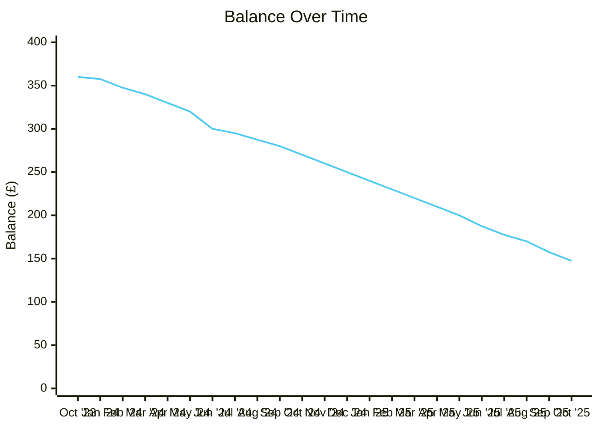

# Actions

- [x] Use Claude Code to add payment summary

# Reference

## Agreement Summary

- **Account**: GB-LOA-0025-6172
- **Type**: Fixed Sum Credit Agreement (0% interest)
- **Date**: 17 October 2023
- **Term**: 36 payments over 39 months (ends ~January 2027)
- **Credit amount**: £360.00
- **Initial deposit**: £69.00 (paid at start, reducing balance to £360.00)

| Period | Direct Debits | Vitality Contributions | Total Paid | Balance |
|--------|--------------|----------------------|-----------|---------|
| Oct 2023 – Oct 2024 | £136.50 | £22.50 | £159.00 | £270.00 |
| Oct 2024 – Oct 2025 | £112.50 | £10.00 | £122.50 | £147.50 |
| **Total** | **£249.00** | **£32.50** | **£281.50** | **£147.50** |

## Monthly Transactions

| Month | Direct Debit | Vitality | Balance |
|-------|-------------|---------|---------|
| Oct 2023 | £69.00 (deposit) | — | £360.00 |
| Jan 2024 | — | £2.50 | £357.50 |
| Feb 2024 | £7.50 | £2.50 | £347.50 |
| Mar 2024 | £7.50 | — | £340.00 |
| Apr 2024 | £10.00 | — | £330.00 |
| May 2024 | £10.00 | — | £320.00 |
| Jun 2024 | £10.00 | £10.00 | £300.00 |
| Jul 2024 | — | £5.00 | £295.00 |
| Aug 2024 | £5.00 | £2.50 | £287.50 |
| Sep 2024 | £7.50 | — | £280.00 |
| Oct 2024 | £10.00 | — | £270.00 |
| Nov 2024 | £10.00 | — | £260.00 |
| Dec 2024 | £10.00 | — | £250.00 |
| Jan 2025 | £10.00 | — | £240.00 |
| Feb 2025 | £10.00 | — | £230.00 |
| Mar 2025 | £10.00 | — | £220.00 |
| Apr 2025 | £10.00 | — | £210.00 |
| May 2025 | £10.00 | — | £200.00 |
| Jun 2025 | £10.00 | £2.50 | £187.50 |
| Jul 2025 | £7.50 | £2.50 | £177.50 |
| Aug 2025 | £7.50 | — | £170.00 |
| Sep 2025 | £10.00 | £2.50 | £157.50 |
| Oct 2025 | £7.50 | £2.50 | £147.50 |

## Statements

![[GB-ORD-0026-0176 - Annual Statement - 2023-10-17 to 2024-10-16.pdf]]![[GB-ORD-0026-0176 - Annual Statement - 2024-10-17 to 2025-10-16.pdf]]
