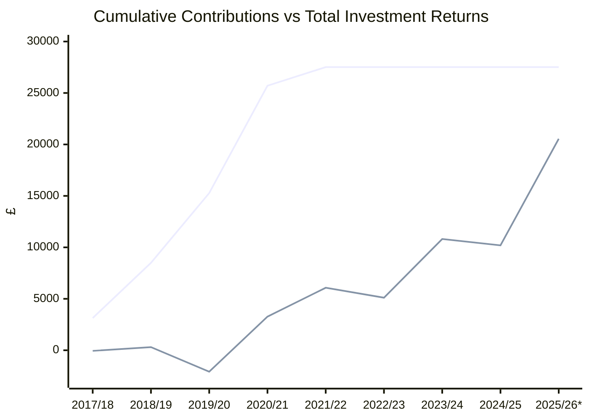
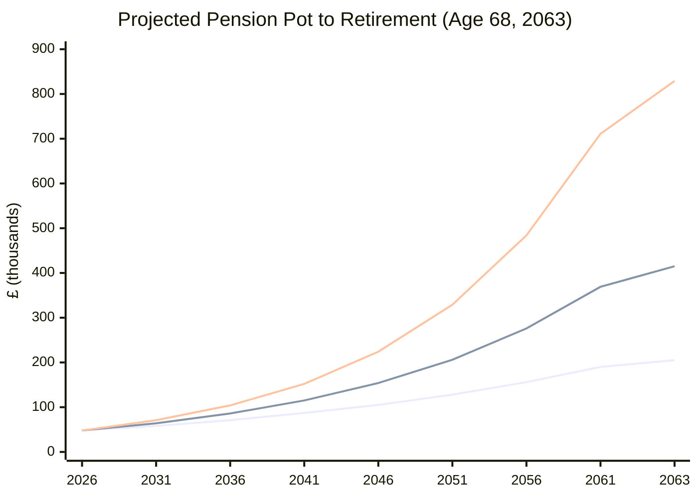

# Fidelity Pension (Credit Suisse Master Trust)

> Source: [PlanViewer](https://www.planviewer.fidelity.co.uk/planviewer/DisplayMyPlanMemberStatement.action) — custom date range, full statement

## Performance by Tax Year

| Tax Year | Opening Balance | Total Contributions | Employer  | Bonus     | Investment Change | Closing Balance | Rate of Return |
| -------- | --------------- | ------------------- | --------- | --------- | ----------------- | --------------- | -------------- |
| 2017/18  | £0.00           | £3,133.00           | £3,133.00 | —         | -£56.73           | £3,076.27       | -3.41%         |
| 2018/19  | £3,076.27       | £5,362.50           | £5,362.50 | —         | +£364.20          | £8,802.97       | +6.59%         |
| 2019/20  | £8,802.97       | £6,780.20           | £6,780.20 | —         | -£2,387.15        | £13,196.02      | -20.05%        |
| 2020/21  | £13,196.02      | £10,431.04          | £7,631.04 | £2,800.00 | +£5,349.49        | £28,976.55      | +31.84%        |
| 2021/22  | £28,976.55      | £1,806.00           | £1,806.00 | —         | +£2,803.18        | £33,585.73      | +9.21%         |
| 2022/23  | £33,585.73      | £0                  | —         | —         | -£963.31          | £32,622.42      | -2.88%         |
| 2023/24  | £32,622.42      | £0                  | —         | —         | +£5,702.79        | £38,325.21      | +17.53%        |
| 2024/25  | £38,325.21      | £0                  | —         | —         | -£619.86          | £37,705.35      | -1.62%         |
| 2025/26* | £37,705.35      | £0                  | —         | —         | +£10,355.97       | £48,061.32      | +27.55%        |

\* 2025/26 is a partial year, data as at 04 Apr 2026.

## Charts

### Cumulative Contributions vs Total Returns

## Retirement Projection (Born 1995)

> **Assumptions:** No further contributions · State pension age 68 (year 2063) · Growth rates are nominal (not inflation-adjusted) · Does not include UK State Pension (~£11,500/yr currently)

Starting pot: **£48,061** (April 2026)

| Scenario    | Growth Rate | Pot at 68 | Annual Income (4% SWR) |
| ----------- | ----------- | --------- | ---------------------- |
| Conservative | 4% p.a.    | ~£205,000 | ~£8,200/yr             |
| Moderate    | 6% p.a.     | ~£415,000 | ~£16,600/yr            |
| Optimistic  | 8% p.a.     | ~£829,000 | ~£33,200/yr            |

The current pot is entirely from the Credit Suisse employer period (2017–2022). No contributions have been made in the last 4 years — **additional contributions would substantially improve all scenarios.** Even modest regular contributions compounded over 37 years could double the projected outcome.

## How to Update

1. Visit [PlanViewer Online Statements](https://www.planviewer.fidelity.co.uk/planviewer/DisplayMyPlanMemberStatement.action)
2. Select **Choose custom date range**
3. Set From: `06 Apr YYYY`, To: `05 Apr YYYY+1`
4. Select **Full statement** → **Create statement**
5. Expand **Your account summary** and **Your personal rate of return**
