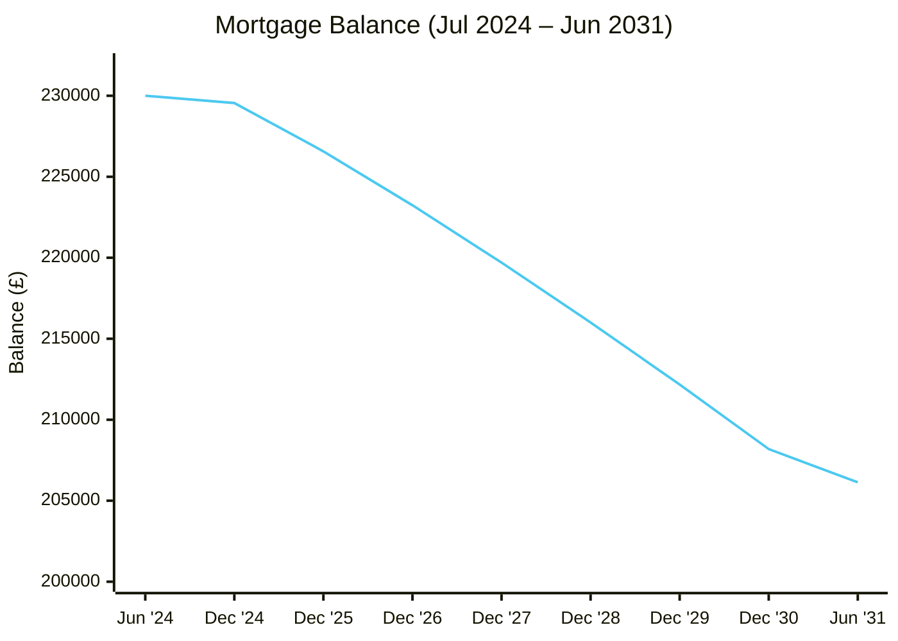
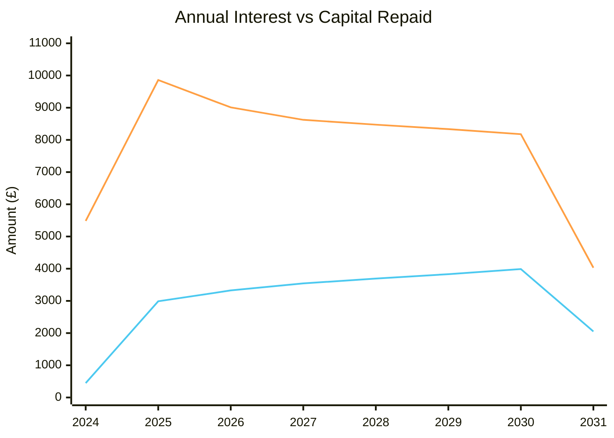
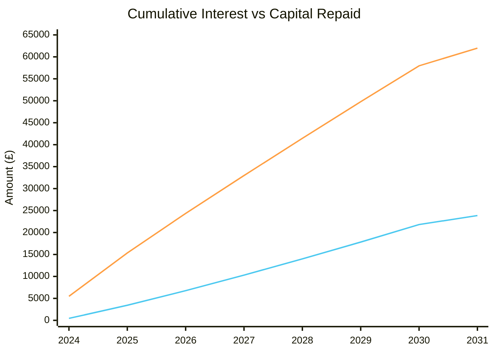

# Actions

# Reference

## Mortgage Summary

- **Original advance**: £230,000.00
- **Agreed repayment date**: June 2059

| Period | Rate | Monthly Payment |
|--------|------|----------------|
| Jul 2024 – Mar 2026 | 4.34% fixed | £1,070.44 |
| Apr 2026 – Jun 2031 | 3.89% fixed | £1,013.79 |

### 7-Year Overview (Jul 2024 – Jun 2031)

> Figures for 2024–2025 are from statements. 2026 onwards are projections.
> 2026 is a split year: Jan–Mar at 4.34% (£1,070.44/month), Apr–Dec at 3.89% (£1,013.79/month).
> 2024 capital repaid is net of the £999 product/reservation fee capitalised into the balance.

| Year           | Payments       | Interest       | Capital Repaid | Balance  |
| -------------- | -------------- | -------------- | -------------- | -------- |
| 2024 (Jul–Dec) | £6,928.60      | £5,482.84      | £446.76        | £229,553 |
| 2025           | £12,845.28     | £9,858.70      | £2,986.58      | £226,567 |
| 2026           | £12,335.43     | £9,010.15      | £3,325.28      | £223,241 |
| 2027           | £12,165.48     | £8,622.70      | £3,542.78      | £219,699 |
| 2028           | £12,165.48     | £8,472.56      | £3,692.92      | £216,006 |
| 2029           | £12,165.48     | £8,335.12      | £3,830.36      | £212,175 |
| 2030           | £12,165.48     | £8,177.30      | £3,988.18      | £208,187 |
| 2031 (Jan–Jun) | £6,082.74      | £4,030.42      | £2,052.32      | £206,135 |
| **Total**      | **£86,853.97** | **£61,989.79** | **£23,864.18** |          |

■ Cumulative Interest &nbsp;&nbsp; ■ Cumulative Capital Repaid

### Monthly Payments

| Month | Payment |
|-------|---------|
| Jul 2024 | £1,576.40 |
| Aug 2024 | £1,070.44 |
| Sep 2024 | £1,070.44 |
| Oct 2024 | £1,070.44 |
| Nov 2024 | £1,070.44 |
| Dec 2024 | £1,070.44 |
| Jan 2025 | £1,070.44 |
| Feb 2025 | £1,070.44 |
| Mar 2025 | £1,070.44 |
| Apr 2025 | £1,070.44 |
| May 2025 | £1,070.44 |
| Jun 2025 | £1,070.44 |
| Jul 2025 | £1,070.44 |
| Aug 2025 | £1,070.44 |
| Sep 2025 | £1,070.44 |
| Oct 2025 | £1,070.44 |
| Nov 2025 | £1,070.44 |
| Dec 2025 | £1,070.44 |

## Mortgage Statements

### 2024

![[Mortgage Summary 2024.pdf]]

### 2025

![[Mortgage Summary 2025.pdf]]

# Log

## 2026-03-05

- Agreed to change our product early to make use of interest rates before they were due to increase
- Agreed to change product within Nationwide to a 5-year fixed rate of 3.89%
- Added the £999 product fee to our total owed amount
