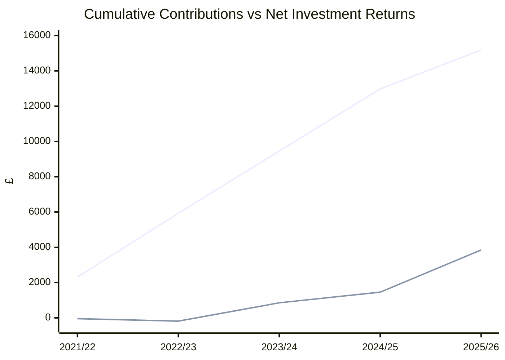
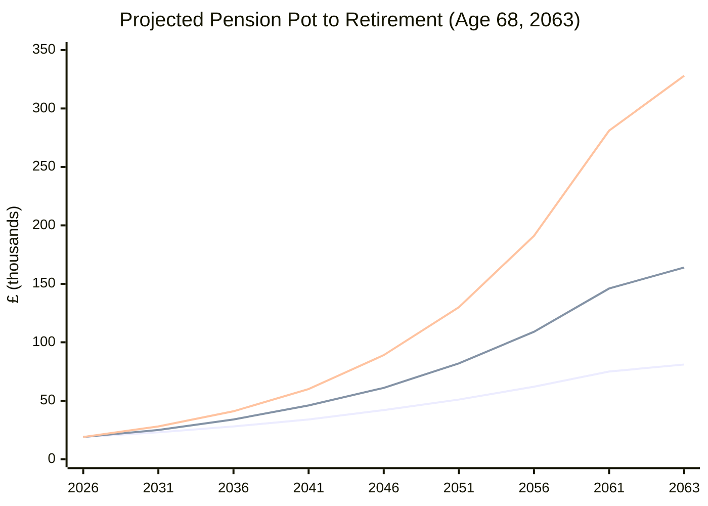

# Nest Pension

> Source: [Nest Member Portal](https://member.nestpensions.org.uk/app/dashboard) — annual statements (scheme year 1 Apr – 31 Mar)

## Performance by Scheme Year

| Scheme Year | Opening Balance | Total Contributions | Member    | Employer   | Tax Relief | Investment Change | Closing Balance |
| ----------- | --------------- | ------------------- | --------- | ---------- | ---------- | ----------------- | --------------- |
| 2021/22†    | £0.00           | £2,311.47           | £1,174.08 | £880.56    | £256.83    | -£43.81           | £2,267.66       |
| 2022/23     | £2,257.14       | £3,618.93           | £146.76   | £3,398.79  | £73.38     | -£140.07          | £5,736.00       |
| 2023/24     | £5,736.00       | £3,522.24           | £0.00     | £3,522.24  | £0.00      | +£1,037.60        | £10,295.84      |
| 2024/25     | £10,295.84      | £3,522.24           | £0.00     | £3,522.24  | £0.00      | +£603.15          | £14,421.23      |
| 2025/26*    | £14,421.23      | £2,210.83           | £0.00     | £2,210.83  | £0.00      | +£2,390.79        | £19,022.85      |

† Partial year — joined Nest on 28 July 2021.
\* Partial year, current value as of 2 April 2026. Contribution data estimated from payslips.

> Investment change figures are **net of charges** (1.8% contribution charge + 0.3% annual management charge).

## Charges

| Scheme Year | Contribution Charge (1.8%) | Management Charge (0.3%) | Total Charges |
| ----------- | -------------------------- | ------------------------ | ------------- |
| 2021/22     | £41.58                     | £6.80                    | £48.38        |
| 2022/23     | £65.10                     | £17.21                   | £82.31        |
| 2023/24     | £63.36                     | £30.89                   | £94.25        |
| 2024/25     | £63.36                     | £43.26                   | £106.62       |
| 2025/26     | -                          | -                        | -             |

## Charts

### Cumulative Contributions vs Net Investment Returns

## Retirement Projection (Born 1995)

> **Assumptions:** No further contributions · Nest retirement date 5 September 2063 (age 68) · Growth rates are nominal (not inflation-adjusted) · Does not include UK State Pension (~£11,500/yr currently)

Starting pot: **£19,023** (April 2026)

| Scenario     | Growth Rate | Pot at 68  | Annual Income (4% SWR) |
| ------------ | ----------- | ---------- | ---------------------- |
| Conservative | 4% p.a.     | ~£81,000   | ~£3,200/yr             |
| Moderate     | 6% p.a.     | ~£164,000  | ~£6,600/yr             |
| Optimistic   | 8% p.a.     | ~£328,000  | ~£13,100/yr            |

Nest's own projection (assuming continued employer contributions to 2063): **£278,000 in today's money** → ~£19,800/yr income.

## How to Update

1. Log in to [Nest Member Portal](https://member.nestpensions.org.uk/app/secure-messages)
2. Download annual statements from the secure messages inbox (sent each June/July)
3. Extract figures from section **"2. Your Nest pension pot"**
4. Update the table with opening balance, contributions breakdown, investment change, and closing balance
5. Check charges from the **"Taxes, charges and payments"** section

# Reference

- Nest ID: MEM017914223
- Started:  2021-07-28
- To login: [https://www.nestpensions.org.uk/](https://www.nestpensions.org.uk/schemeweb/nest.html?logged=yes)

It appears that Piclo currently operates a Net Pay Arrangement (NPA) a.k.a. Salary Sacrifice. A message from Finance summarises this change

> Hi All, as part of our upcoming switch of payroll providers to PayFit this month at the start of the new 22/23 tax year we have also performed a review of our current pension arrangement with NEST. The outcome of this review, ***which does not affect the £ value of contributions you will receive, ***is that we will be switching the pension from a 'relief at source' model to the 'net pay arrangement (NPA) aka salary sacrifice', the key points of which are set out below:
> - The total 8% pension contribution (5% employee and 3% employers) will remain the same under this new arrangement and you will not lose out on any £ value.
> - Your 5% pension contribution will now be deducted from your pre tax payroll, thus reducing your taxable salary and thus PAYE and National Insurance that you pay each month.
> - Higher rate taxpayers (those earning over £50,270 in 22/23) will no longer need to submit an annual Self Assessment tax return to get their full 40% tax relief on their pension contributions. For anyone who has not already submitted a Self Assessment to claim this tax relief for previous tax years, you can reclaim this relief for the last four tax years if you follow HMRC's [instructions](https://www.gov.uk/self-assessment-tax-returns).
> 
> If you do not wish to be transferred to the NPA arrangement, please let me know by midday on Tuesday 19th April, however the company believes this is the best scheme for everyone.

We have a cap on Pensionable Earnings of £44,030 which aligns with what I was seeing in my payslips.

# Log

##  2025-03-01

- Read all letters

##  2024-09-01

- Confirmed that my constant employee contributions are there because we have a cap in Pensionable Earnings at £44,030
- There is a 9 month period where I will have been on the Relief at Source arrangement
- Finance team suggested I need to complete a Self Assessment to claim the tax relief on earnings taxable at 40% during the time we had a “Relief at Source” pension (ending 21/22 tax year)
	- 2026-04-06: I've likely missed the deadline so I'm assuming it's no longer possible

##   2024-04-14

- Update address to 17 Elm Park

##  2023-12-19

- Updated address to 37 Wedgnock Green

##  2022-10-09

- Updated address to Oval
