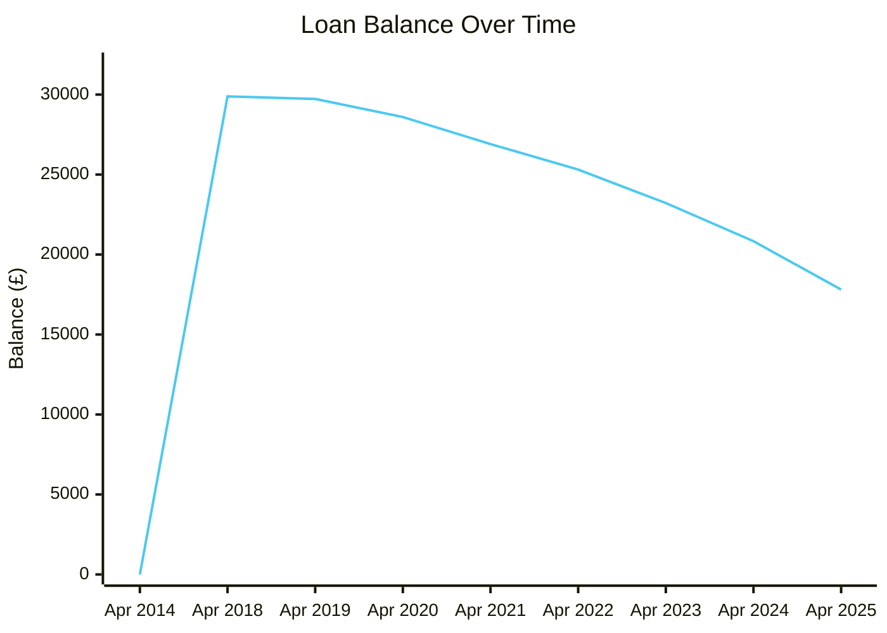
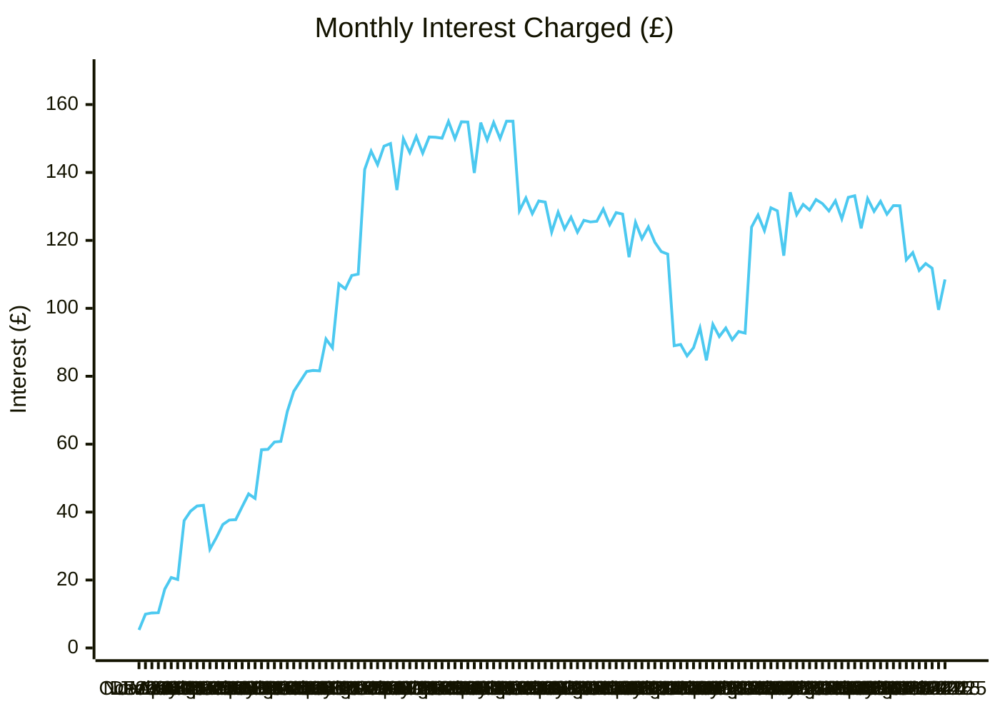
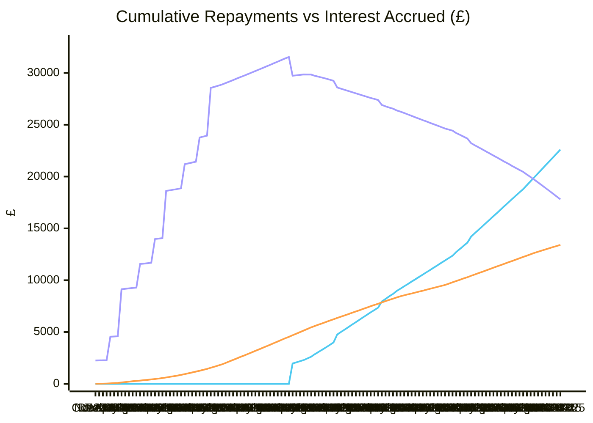
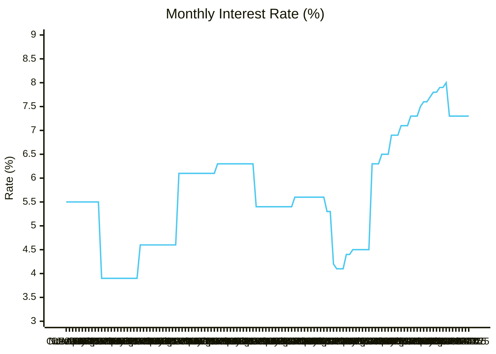

---
tags:
  - account
  - finance
---

# Student Finance England (SFE)

- **Plan Type:** Plan 2
- **Customer Reference Number:** 89194252561
- **Current Balance (Apr 2025):** £17,804.91

## Annual Statements

| Tax Year | Opening Balance | Borrowed | Interest | Repaid | Closing Balance |
|----------|----------------|----------|----------|--------|-----------------|
| 2014–2018 | £0.00 | £27,000.00 | £2,889.15 | £0.00 | £29,889.15 |
| 2018–2019 | £29,889.15 | £0.00 | £1,802.27 | £1,965.00 | £29,726.42 |
| 2019–2020 | £29,726.42 | £0.00 | £1,667.17 | £2,798.00 | £28,595.59 |
| 2020–2021 | £28,595.59 | £0.00 | £1,499.74 | £3,189.00 | £26,906.33 |
| 2021–2022 | £26,906.33 | £0.00 | £1,223.45 | £2,816.00 | £25,313.78 |
| 2022–2023 | £25,313.78 | £0.00 | £1,344.79 | £3,439.00 | £23,219.57 |
| 2023–2024 | £23,219.57 | £0.00 | £1,558.29 | £3,942.00 | £20,835.86 |
| 2024–2025 | £20,835.86 | £0.00 | £1,423.05 | £4,454.00 | £17,804.91 |

**Total repaid:** £22,603.00
**Total interest paid:** £13,407.91

## Monthly Transactions

| Month | Repaid (£) | Interest (£) | Rate (%) | Balance (£) |
|-------|-----------|-------------|---------|------------|
| Oct 2014 | — | 5.29 | 5.5 | £2,255.29 |
| Nov 2014 | — | 9.95 | 5.5 | £2,265.24 |
| Dec 2014 | — | 10.32 | 5.5 | £2,275.56 |
| Jan 2015 | — | 10.37 | 5.5 | £2,285.93 |
| Feb 2015 | — | 17.35 | 5.5 | £4,553.28 |
| Mar 2015 | — | 20.75 | 5.5 | £4,574.03 |
| Apr 2015 | — | 20.17 | 5.5 | £4,594.20 |
| May 2015 | — | 37.48 | 5.5 | £9,131.68 |
| Jun 2015 | — | 40.27 | 5.5 | £9,171.95 |
| Jul 2015 | — | 41.80 | 5.5 | £9,213.75 |
| Aug 2015 | — | 41.99 | 5.5 | £9,255.74 |
| Sep 2015 | — | 29.07 | 3.9 | £9,284.81 |
| Oct 2015 | — | 32.50 | 3.9 | £11,567.31 |
| Nov 2015 | — | 36.33 | 3.9 | £11,603.64 |
| Dec 2015 | — | 37.66 | 3.9 | £11,641.30 |
| Jan 2016 | — | 37.79 | 3.9 | £11,679.09 |
| Feb 2016 | — | 41.59 | 3.9 | £13,970.68 |
| Mar 2016 | — | 45.35 | 3.9 | £14,016.03 |
| Apr 2016 | — | 44.03 | 3.9 | £14,060.06 |
| May 2016 | — | 58.35 | 3.9 | £18,618.41 |
| Jun 2016 | — | 58.48 | 3.9 | £18,676.89 |
| Jul 2016 | — | 60.62 | 3.9 | £18,737.51 |
| Aug 2016 | — | 60.81 | 3.9 | £18,798.32 |
| Sep 2016 | — | 69.61 | 4.6 | £18,867.93 |
| Oct 2016 | — | 75.54 | 4.6 | £21,193.47 |
| Nov 2016 | — | 78.48 | 4.6 | £21,271.95 |
| Dec 2016 | — | 81.41 | 4.6 | £21,353.36 |
| Jan 2017 | — | 81.72 | 4.6 | £21,435.08 |
| Feb 2017 | — | 81.59 | 4.6 | £23,766.67 |
| Mar 2017 | — | 90.95 | 4.6 | £23,857.62 |
| Apr 2017 | — | 88.35 | 4.6 | £23,945.97 |
| May 2017 | — | 107.20 | 4.6 | £28,553.17 |
| Jun 2017 | — | 105.74 | 4.6 | £28,658.91 |
| Jul 2017 | — | 109.67 | 4.6 | £28,768.58 |
| Aug 2017 | — | 110.09 | 4.6 | £28,878.67 |
| Sep 2017 | — | 140.90 | 6.1 | £29,019.57 |
| Oct 2017 | — | 146.30 | 6.1 | £29,165.87 |
| Nov 2017 | — | 142.29 | 6.1 | £29,308.16 |
| Dec 2017 | — | 147.76 | 6.1 | £29,455.92 |
| Jan 2018 | — | 148.50 | 6.1 | £29,604.42 |
| Feb 2018 | — | 134.81 | 6.1 | £29,739.23 |
| Mar 2018 | — | 149.92 | 6.1 | £29,889.15 |
| Apr 2018 | — | 145.83 | 6.1 | £30,034.98 |
| May 2018 | — | 150.59 | 6.1 | £30,185.57 |
| Jun 2018 | — | 145.67 | 6.1 | £30,331.24 |
| Jul 2018 | — | 150.44 | 6.1 | £30,481.68 |
| Aug 2018 | — | 150.37 | 6.1 | £30,632.05 |
| Sep 2018 | — | 150.09 | 6.3 | £30,782.14 |
| Oct 2018 | — | 155.02 | 6.3 | £30,937.16 |
| Nov 2018 | — | 149.98 | 6.3 | £31,087.14 |
| Dec 2018 | — | 154.91 | 6.3 | £31,242.05 |
| Jan 2019 | — | 154.86 | 6.3 | £31,396.91 |
| Feb 2019 | — | 139.83 | 6.3 | £31,536.74 |
| Mar 2019 | 1,965.00 | 154.68 | 6.3 | £29,726.42 |
| Apr 2019 | 111.00 | 149.56 | 6.3 | £29,764.98 |
| May 2019 | 111.00 | 154.74 | 6.3 | £29,808.72 |
| Jun 2019 | 111.00 | 149.98 | 6.3 | £29,847.70 |
| Jul 2019 | 160.00 | 155.11 | 6.3 | £29,842.81 |
| Aug 2019 | 160.00 | 155.09 | 6.3 | £29,837.90 |
| Sep 2019 | 249.00 | 128.73 | 5.4 | £29,717.63 |
| Oct 2019 | 220.00 | 132.48 | 5.4 | £29,630.11 |
| Nov 2019 | 220.00 | 127.85 | 5.4 | £29,537.96 |
| Dec 2019 | 220.00 | 131.61 | 5.4 | £29,449.57 |
| Jan 2020 | 232.00 | 131.27 | 5.4 | £29,348.84 |
| Feb 2020 | 232.00 | 122.44 | 5.4 | £29,239.28 |
| Mar 2020 | 772.00 | 128.31 | 5.4 | £28,595.59 |
| Apr 2020 | 238.00 | 123.37 | 5.4 | £28,480.96 |
| May 2020 | 238.00 | 126.84 | 5.4 | £28,369.80 |
| Jun 2020 | 238.00 | 122.39 | 5.4 | £28,254.19 |
| Jul 2020 | 238.00 | 125.90 | 5.4 | £28,142.09 |
| Aug 2020 | 238.00 | 125.43 | 5.4 | £28,029.52 |
| Sep 2020 | 238.00 | 125.63 | 5.6 | £27,917.15 |
| Oct 2020 | 238.00 | 129.20 | 5.6 | £27,808.35 |
| Nov 2020 | 238.00 | 124.65 | 5.6 | £27,695.00 |
| Dec 2020 | 238.00 | 128.17 | 5.6 | £27,585.17 |
| Jan 2021 | 223.00 | 127.75 | 5.6 | £27,489.92 |
| Feb 2021 | 223.00 | 115.07 | 5.6 | £27,381.99 |
| Mar 2021 | 601.00 | 125.34 | 5.6 | £26,906.33 |
| Apr 2021 | 250.00 | 120.50 | 5.6 | £26,776.83 |
| May 2021 | 249.00 | 123.97 | 5.6 | £26,651.80 |
| Jun 2021 | 223.00 | 119.46 | 5.6 | £26,548.26 |
| Jul 2021 | 286.00 | 116.70 | 5.3 | £26,378.96 |
| Aug 2021 | 226.00 | 115.95 | 5.3 | £26,268.91 |
| Sep 2021 | 226.00 | 88.98 | 4.2 | £26,131.89 |
| Oct 2021 | 226.00 | 89.34 | 4.1 | £25,995.23 |
| Nov 2021 | 226.00 | 85.99 | 4.1 | £25,855.22 |
| Dec 2021 | 226.00 | 88.38 | 4.1 | £25,717.60 |
| Jan 2022 | 226.00 | 94.22 | 4.4 | £25,585.82 |
| Feb 2022 | 226.00 | 84.67 | 4.4 | £25,444.49 |
| Mar 2022 | 226.00 | 95.29 | 4.5 | £25,313.78 |
| Apr 2022 | 228.00 | 91.70 | 4.5 | £25,177.48 |
| May 2022 | 228.00 | 94.19 | 4.5 | £25,043.67 |
| Jun 2022 | 228.00 | 90.72 | 4.5 | £24,906.39 |
| Jul 2022 | 228.00 | 93.19 | 4.5 | £24,771.58 |
| Aug 2022 | 228.00 | 92.70 | 4.5 | £24,636.28 |
| Sep 2022 | 228.00 | 123.94 | 6.3 | £24,532.22 |
| Oct 2022 | 228.00 | 127.50 | 6.3 | £24,431.72 |
| Nov 2022 | 360.00 | 122.87 | 6.3 | £24,194.59 |
| Dec 2022 | 296.00 | 129.60 | 6.5 | £24,028.19 |
| Jan 2023 | 309.00 | 128.70 | 6.5 | £23,847.89 |
| Feb 2023 | 296.00 | 115.50 | 6.5 | £23,667.39 |
| Mar 2023 | 582.00 | 134.18 | 6.9 | £23,219.57 |
| Apr 2023 | 335.00 | 127.57 | 6.9 | £23,012.14 |
| May 2023 | 322.00 | 130.60 | 6.9 | £22,820.74 |
| Jun 2023 | 322.00 | 128.91 | 7.1 | £22,627.65 |
| Jul 2023 | 335.00 | 132.01 | 7.1 | £22,424.66 |
| Aug 2023 | 322.00 | 130.83 | 7.1 | £22,233.49 |
| Sep 2023 | 335.00 | 128.66 | 7.3 | £22,027.15 |
| Oct 2023 | 322.00 | 131.65 | 7.3 | £21,836.80 |
| Nov 2023 | 335.00 | 126.35 | 7.3 | £21,628.15 |
| Dec 2023 | 335.00 | 132.69 | 7.5 | £21,425.84 |
| Jan 2024 | 322.00 | 133.15 | 7.6 | £21,236.99 |
| Feb 2024 | 335.00 | 123.56 | 7.6 | £21,025.55 |
| Mar 2024 | 322.00 | 132.31 | 7.7 | £20,835.86 |
| Apr 2024 | 322.00 | 128.54 | 7.8 | £20,642.40 |
| May 2024 | 322.00 | 131.52 | 7.8 | £20,451.92 |
| Jun 2024 | 381.00 | 127.70 | 7.9 | £20,198.62 |
| Jul 2024 | 381.00 | 130.26 | 7.9 | £19,947.88 |
| Aug 2024 | 381.00 | 130.20 | 8.0 | £19,697.08 |
| Sep 2024 | 381.00 | 114.26 | 7.3 | £19,430.34 |
| Oct 2024 | 381.00 | 116.39 | 7.3 | £19,165.73 |
| Nov 2024 | 381.00 | 111.17 | 7.3 | £18,895.90 |
| Dec 2024 | 381.00 | 113.19 | 7.3 | £18,628.09 |
| Jan 2025 | 381.00 | 111.80 | 7.3 | £18,358.89 |
| Feb 2025 | 381.00 | 99.53 | 7.3 | £18,077.42 |
| Mar 2025 | 381.00 | 108.49 | 7.3 | £17,804.91 |

## Charts

### Balance Over Time

### Interest Over Time (£)

### Cumulative Repayments vs Interest Accrued

■ Cumulative Repayments &nbsp;&nbsp; ■ Cumulative Interest Accrued &nbsp;&nbsp; ■ Loan Remaining

### Interest Rate Over Time (%)

## Notes

- Loan originally taken out for a university degree (Plan 2 = post-2012 entrant)
- Repayments collected via PAYE through HMRC — no repayments until tax year 2018–19
- Peak balance: £29,889.15 (Apr 2018) — peak interest rate: 8.0% (Aug 2024)
- Statements available at [manage-student-loan-balance.service.gov.uk](https://www.manage-student-loan-balance.service.gov.uk)
- PDFs saved to `~/Downloads/SFE-Statement-YYYY-MM-DD.pdf`
