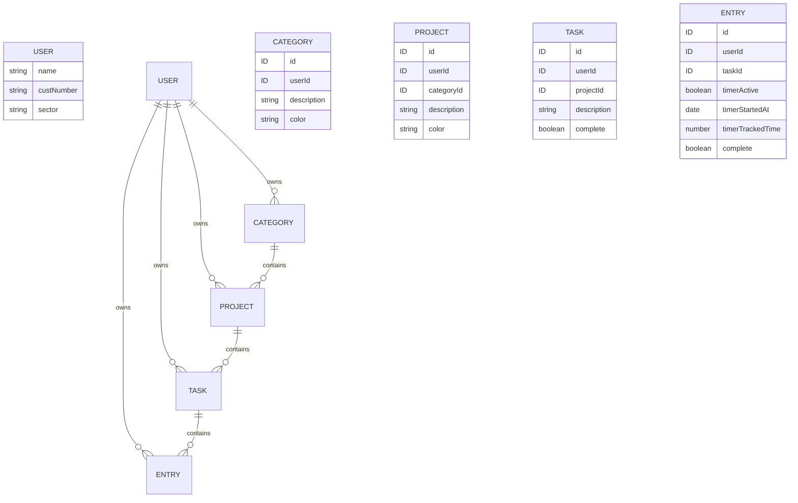

# Screenshots

![[clear-habits-old.gif]]
![[clear-habits-new.gif]]
# Resources

## Ideas

- Use [State Machines](https://github.com/statelyai/xstate/tree/main/packages/xstate-vue) to store button states / communicate to server

## Inspiration

- [Realtime Kanban Board](https://codeburst.io/real-time-kanban-board-on-vue-js-431cfb8a8325)
- [Vue Basic Tutorial](https://github.com/na018/vue_basics_tut)
- [actiTIME - Time Tracking Software for Smart Teams](https://www.actitime.com/)
- [Ask HN: What are good self hosted time tracking software for consultants? | Hacker News](https://news.ycombinator.com/item?id=34013754)
- [TimeTagger](https://timetagger.app/app/demo)
- https://prompts.ray.so/code
- https://app.seline.so/share/edain.io
- https://t0ggles.com/viva-metric

## Links

- [RealWorldApp - Node](https://github.com/gothinkster/node-express-realworld-example-app)
- [RealWorldApp - Vue](https://github.com/gothinkster/vue-realworld-example-app)
- [Material Design Icons](https://materialdesignicons.com/)

# Setup Process

Install [VueCLI](https://cli.vuejs.org/)
`npm install -g @vue/cli`

# Server Setup

[Thinkster - Building a Production Ready Node.js JSON API](https://thinkster.io/tutorials/node-json-api)

## Folder Structure

- `config`: Configuration folder for environment variables
- `models`: Storing Mongoose models, schemas and entrypoints
- `public`: Storing static files to be served such as HTML, CSS, and Javascript
- `routes`: Where we define the routes for our application
- `app.js`: Entrypoint for the application

## `nodemon`

By default, Node doesn't monitor changes in files and is meant for production. In development, we'll require the `nodemon` package.

`npm install -g nodemon`

# Production Deployment

- [x] [[Linode#Setting Up a New Instance|Linode - Setting Up a New Instance]]
- [x] [[Linode#Deploying to Linode Using Ansible|Linode - Deploying to Linode Using Ansible]]
- [x] Deploying a Node Server using NGINX
	1. Use [Node Server Deployment](https://www.mbejda.com/deploying-node-applications-with-ansible/) for inspiration
	2. Use [Flask Tasks Config](https://github.com/oliveryh/flask-tasks/blob/master/conf/setup.yml) for inspiration
- [x] Deploy the front end properly
- Add deployment code to Github Actions

## Deploying a Production Node Server

[DigitalOcean - How to set up a NodeJS application for production](https://www.digitalocean.com/community/tutorials/how-to-set-up-a-node-js-application-for-production-on-ubuntu-16-04)

### Install NodeJS

First we need to install `nodejs`, `npm` and `build-essential`

### PM2

Next we'll use PM2, a process manager for NodeJS applications that allows us to daemonize the application easily.

### NGINX

https://medium.com/@kornchotpitakkul/deploy-a-node-js-and-vue-js-with-nginx-ssl-on-ubuntu-465f31216dc9

### UFW

UFW = Uncomplicated Firewall

We are going to enable the NGINX Http preset since we don't have TLS yes, and then enable the firewall.

### Environment Injection

[Vue CLI - Modes and Environment Variables](https://cli.vuejs.org/guide/mode-and-env.html#environment-variables)

Since the client doesn't have an environment, we can use the `.env` file to define environment variables we want stored in the client.

In this case, we'll point towards the correct API URL when we're in production.

Environment variables must be prefixed with `VUE_APP_` to avoid accidently sharing other keys.

# Tasks

## MVP (2020.1)

- [X] Find a way to parse the API_URL configuration for the URL at run time. Currently I need to hard code the new API url
- [X] Setup nginx config for URL and ensure the firewall isn't blocking requests.
- [x] UI Changes
	- [x] Delete button
	- [x] Ability to edit text by clicking on cell
- [x] Refactor names to be in line with basic CRUD operations
- Refactor with linter to have consistent style
- Refactor error snackbar to display outside each view
- Ability for errors to handle status codes
- Decide between SemVer and CalVer

## Second Version (2020.2)

- Task categories
- Improved task item UI formatting
- Add route guarding while logged in as well as logged out
- Add TLS Authentication

# Test Writing

## Types of Tests

- **Authentication**: For most operations, does an error get thrown if you're not authenticated
- **Authorisation**: If operating on a model, do you own that model? (Both primary key and foreign key)
- **Data doesn't exist**: If the model you're operating on doesn't exist, is an error thrown (Both primary key and foreign key)
- **Required Attribute**: If an attribute is required, does an error get thrown when it's not provided
- **Non-empty Attribute**: If an attribute can't be empty / null, does an error get thrown if it is
- **Input validation** - If you're expecting a particular type or validation of an input. Does a useful error message get thrown when this isn't correct?

```
// success
// authentication
// authorisation
// missing key
// required attribute
// validation
```



# Apollo Client

[Harusa - Apollo Vue Course](https://hasura.io/learn/graphql/vue/introduction/)
It appears that using the apollo client is the best way to hand state when using the GraphQL API. One option going forward would be to create a mini app that makes use of the newly created GraphQL API and tests out the following functionality:
- Global state management
- The use of caching
- Optimistic mutations to reduce the effects of latency

## Displaying Errors

https://stackoverflow.com/questions/45199311/show-apollo-mutation-error-to-user-in-vue-js
https://hasura.io/learn/graphql/vue/introduction/
https://apollo.vuejs.org/guide/#sponsors

# Refactoring

``` js
```

# Sub Path URL

```
 export default new Router({
+  base: '/tasks',
   routes: [
     {
       path: '/',
diff --git a/client/vue.config.js b/client/vue.config.js
index e412d57..d2ffec0 100644
--- a/client/vue.config.js
+++ b/client/vue.config.js
@@ -1,6 +1,6 @@
 module.exports = {
   transpileDependencies: ['quasar', '@carbon/charts-vue'],
-
+  publicPath: '/tasks',
   pluginOptions: {
     quasar: {
```

# Clean Up

Remove tasks that have no associated entries

```sql
DELETE FROM app_public.tasks t WHERE t.id IN (SELECT t.id FROM app_public.tasks t LEFT JOIN app_public.entries e ON e.task_id = t.id WHERE e.id IS NULL);
```

Remove entries that were not completed in the past

```sql
DELETE FROM app_public.entries WHERE id IN (SELECT e.id FROM app_public.entries e WHERE e.complete = false AND e.date < '2022-10-01' AND e.date <> 'backlog');
```

# Design Patterns

## Query / Mutation Store

https://github.com/framasoft/mobilizon/blob/54aa628403fb911ef90789944508854e9d3cf1a8/src/composition/apollo/user.ts#L13

This project uses the following syntax to abstract out querying data

```
export function useCurrentUserClient() {
  const {
    result: currentUserResult,
    error,
    loading,
    onResult,
  } = useQuery<{
    currentUser: ICurrentUser;
  }>(CURRENT_USER_CLIENT);

  const currentUser = computed(() => currentUserResult.value?.currentUser);
  return { currentUser, error, loading, onResult };
}
```

## Testing

- [component-library (infermedica) (18 ★)](https://github.com/infermedica/component-library) - They have a nice testing strategy

# Database Level Changes

## Authenticating as User

`SET local jwt.claims.person_id to 1;`

# Wind Down Assets

```
DB_URL=postgres://postgres:<password>@localhost:5432/clearhabits_postgraphile
SERVER_PORT=8000
SERVER_SECRET=<password>
```

I've been trying to add focus management to the cards of Clear Habits. What I'd like to get is the ability to press the arrow up/down keys to focus the next card in the list and eventually use shortcuts to take actions on the highlighted card.

The [Accordian component](https://ui-thing.behonbaker.com/components/accordion#usage) from UI Thing appears to contain a few primitive actions that I want, namely:
- Up/Down keys select the next item in the accordian
- Enter takes some action on the highlighted item

The best next step might be to see if I can take the "List" component from UI Thing and somehow add up/down arrow actions
