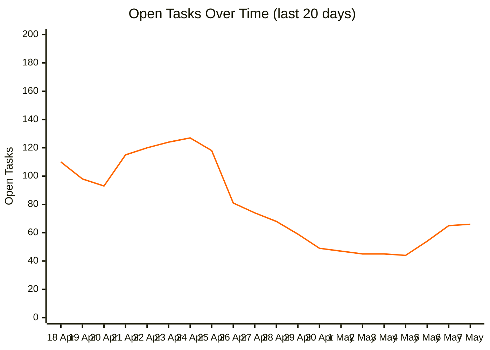

# Open Tasks Over Time

Tracks the number of open tasks (`- [ ]`) across the vault, one commit per day for the last 20 days. Generated by `__scripts__/count_open_tasks.py`.

To regenerate: `python3 __scripts__/count_open_tasks.py` (or pass a number for full-history sampling, e.g. `python3 __scripts__/count_open_tasks.py 30`)

| Date | Open Tasks |
|------|-----------|
| 2026-05-07 | 66 |
| 2026-05-06 | 65 |
| 2026-05-05 | 54 |
| 2026-05-04 | 44 |
| 2026-05-03 | 45 |
| 2026-05-02 | 45 |
| 2026-05-01 | 47 |
| 2026-04-30 | 49 |
| 2026-04-29 | 59 |
| 2026-04-28 | 68 |
| 2026-04-27 | 74 |
| 2026-04-26 | 81 |
| 2026-04-25 | 118 |
| 2026-04-24 | 127 |
| 2026-04-23 | 124 |
| 2026-04-22 | 120 |
| 2026-04-21 | 115 |
| 2026-04-20 | 93 |
| 2026-04-19 | 98 |
| 2026-04-18 | 110 |
