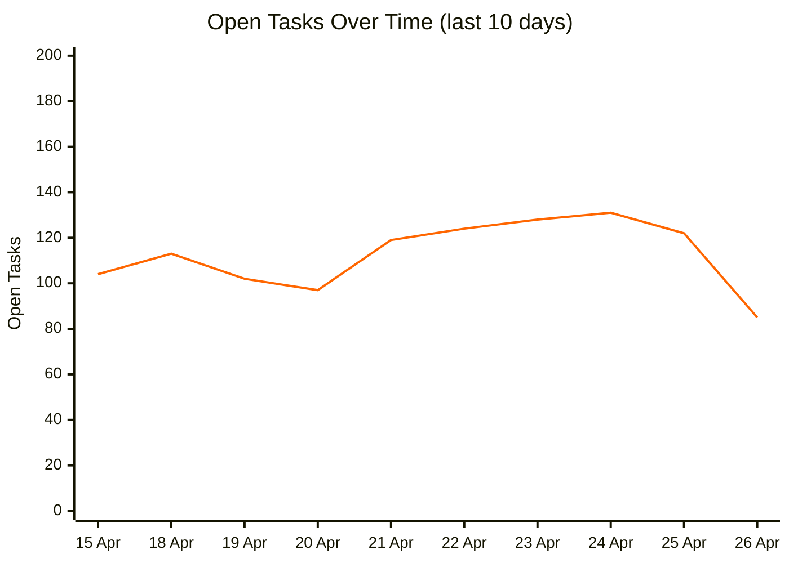

# Open Tasks Over Time

Tracks the number of open tasks (`- [ ]`) across the vault, one commit per day for the last 20 days. Generated by `__scripts__/count_open_tasks.py`.

To regenerate: `python3 __scripts__/count_open_tasks.py` (or pass a number for full-history sampling, e.g. `python3 __scripts__/count_open_tasks.py 30`)

| Date | Open Tasks |
|------|-----------|
| 2026-04-26 | 85 |
| 2026-04-25 | 122 |
| 2026-04-24 | 131 |
| 2026-04-23 | 128 |
| 2026-04-22 | 124 |
| 2026-04-21 | 119 |
| 2026-04-20 | 97 |
| 2026-04-19 | 102 |
| 2026-04-18 | 113 |
| 2026-04-15 | 104 |
