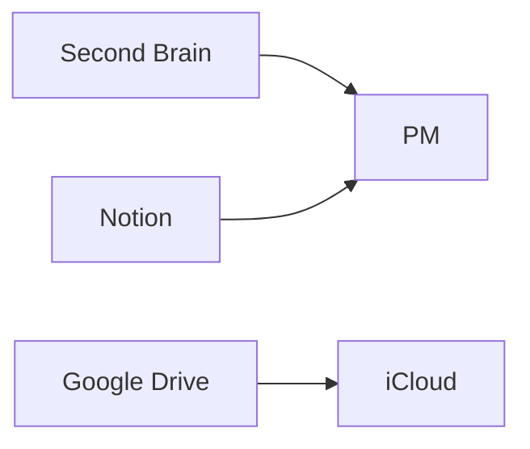

# Motivation

I’ve attempted to map out my digital life with some success but it’s still an overwhelming effort to think about how to simplify it. I’d like to instead consider creating a new space where I can bring over what I truly need and remove what’s left.

# Plan

1. [x] Buy Obsidian Sync
2. [x] Start migrating things over to this new synced vault
3. [x] Plot the size of the repo over time

I’m hoping it’ll be easier to see second-brain slowly go down in size and this new repo to go up (but not as much). In conjunction with all this, I’d like to explore how Claude Code might help me.

Ideally the vault would not include any excess whatsoever.

Some things to avoid too:
- Hoarding data for historical reasons (I hardly keep up with personal recommendations of TV, Reading, Movies let alone what the internet suggests)

- [ ] Reduce
	- [x] Links
		- [x] Write script to check URLs and if they 404
	- [x] YouTube Kanban
		- [x] Archive
	- [x] Drawings
	- [ ] Readwise
		- [x] Remove tweet directory and syncing
		- [ ] Books could be consolidated with Collection notes
- [ ] Plugins
	- [x] Go through each plugin and either delete from Second Brain or transfer to pm
- [ ] Appearance
	- [ ] Theme
- [ ] Improve
	- [ ] Replace Dataview with Obsidian Bases where possible and if it looks better
- [ ] Tear Down
	- [ ] Set up a 1 way sync between this vault and a GitHub repo
		- Possibly using the headless sync mode and a GitHub action
	- [ ] Remove mobile
		- [ ] Second Brain vault
		- [x] Working Copy app
		- [x] Apple shortcuts
- [ ] GitHub Repo
	- [x] Restore changes after commit `45d287e`
	- [ ] Set up a 1 way sync between this and a GitHub repo
	- [ ] Rewrite history in `second-brain` repo
		- [ ] Group commits into days
		- [ ] Remove files that were accidentally committed
		- [ ] Ensure commit dates don't change
- [ ] Johny Decimal naming
- [x] Collections
	- [x] Migrate to pm

# Flow of Data

# Log

## 2026-03-25

- Removed Working Copy from mobile phone
## 2026-03-21

- I used Claude Code to extract topics from Daily Notes and move them into individual notes
## 2026-03-14

- I started migrating from commit `45d287e` in the Second Brain repo
- Used Claude Code to modify https://github.com/amedeedaboville/gix-of-theseus to filter for markdown files and ignore 'Collection' and 'Readwise' directories to see git history
	- The lack of burndown implies a lot of my notes are additive

![[git-history-of-second-brain-repo.png]]