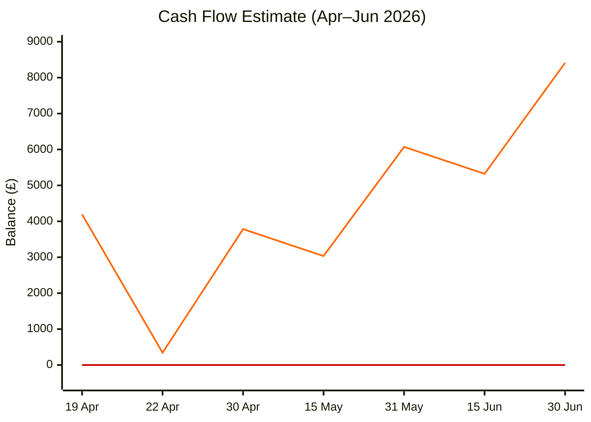

# Motivation

Estimate take-home earnings over the next few months to support financial planning.

# Cash Flow Projection

Starting balance £4,193 on 19 Apr. Assumptions: net salary £3,839.72 paid end of month, £3,700 outgoing on 22 Apr, burn rate £350/week (£50/day). Red line = £0.

# Payslip Breakdown (from Feb 2026)

| Item | Amount |
|------|--------|
| Gross salary | £5,843.75 |
| PAYE Income Tax | −£1,407.66 |
| Employee NIC | −£284.37 |
| Student Loan (Plan 2) | −£312.00 |
| **Net take-home** | **£3,839.72** |

# Description

I've made more financial commitments this year in the form of pet costs, renovations, and possibly getting a joint account with Chloe. I'd like to plot these out to better understand the impacts of interest, inflation, and renewals.

# Actions

- Document all current outgoings
- Factor in additional benefits at work
- Model potentially increasing joint spending with Chloe
- Model potentially paying for therapy
- Get statement from Chloe
- How much am I spending on London trips each month
- Map salary against inflation increases per year
- Plot Mortgage contributions and remainder
- Plot SFE borrowing and interest

# Issues

## Gather financial history

For each major financial commitment, put a form of data into Obsidian and make Claude make some high-level summaries.

# Log

## 2026-04-19

- Created project to track earnings estimates
- Added cash flow chart based on Feb 2026 payslip (net £3,839.72), £3,700 payment on 22 Apr, £50/day burn rate
