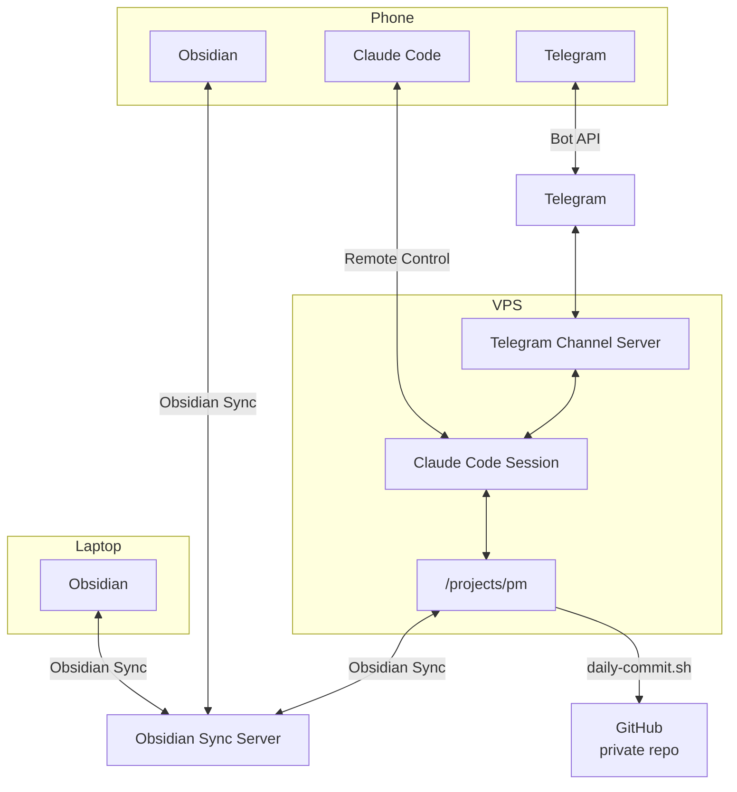

# Motivation

I've attempted to map out my digital life with some success but it's still an overwhelming effort to think about how to simplify it. I'd like to instead consider creating a new space where I can bring over what I truly need and remove what's left.

In addition to consolidating data into Obsidian, I want to be able to easily modify and query it using an LLM like Claude Code.

# Approach

Previously I used GitHub has my main way to backup and keep Obsidian synced between devices. This was cumbersome, and since Obsidian Sync is relatively affordable, I wanted to consider it as an alternative.

Another key principle in this whole project is to cut excess and avoid hoarding. Thankfully agents are pretty good at consolidating, so I'll often use it to cut out the noise.

## Basic Steps

The basic steps ended up being:

1. Buy Obsidian Sync
2. Migrate from other sources over to a fresh vault called `pm` including:
	1. Notion
	2. Google Drive
	3. Piclo Obsidian Repo
	4. iCloud
	5. Dropbox
3. Group existing commits in `second-brain` by day and remove accidentally committed files historically
4. Use a combination of services to allow me to communicate to Claude on my phone and keep my Obsidian project up to date
	1. Obsidian sync is running continuously in the filesystem of my VPS
	2. A Claude session is also being run on the same filesystem
	3. Any change Claude makes is immediately synced, and I can see the change on my mobile phone and desktop
	4. A daily backup at 11 occurs to git, mostly to track lineage of data and ideas

## What I'm Keeping

Ultimately this project is intended to reduce the number of tools being used. At the moment the core ones appear to be:

- TickTick - Habits, Routines, and Tasks within a Sprint
- Linear - Longer term goals
- Obsidian - Everything I possibly can put in here
- iCloud - Large file storage

You could argue that some functionality of TickTick and Linear could be replicated in Obsidian, however I've found I'm often playing catch-up on particular UI or features, so I'll keep these as they are for now.

# Setup

## Architecture



## VPS + Claude Code

**Prerequisites:** Claude Pro/Max, Obsidian Sync, VPS (~$5-10/mo), Node.js 22+

```bash
# 1. Install tools
curl -fsSL https://deb.nodesource.com/setup_22.x | sudo -E bash - && sudo apt install -y nodejs
npm install -g @anthropic-ai/claude-code obsidian-headless

# 2. Authenticate
claude login && ob login

# 3. Set up vault
mkdir -p ~/vault && cd ~/vault
ob sync-setup --vault "Your Vault Name" && ob sync
```

**4. systemd service** — create `/etc/systemd/system/obsidian-sync.service`:

```ini
[Unit]
Description=Obsidian Headless Sync
After=network.target

[Service]
ExecStart=/home/ansible/.nvm/versions/node/v22.14.0/bin/node /home/ansible/.nvm/versions/node/v22.14.0/lib/node_modules/obsidian headless/cli.js sync --continuous
WorkingDirectory=/projects/pm
Restart=always
User=ansible

[Install]
WantedBy=multi-user.target
```

```bash
sudo systemctl enable obsidian-sync && sudo systemctl start obsidian-sync
```

```bash
# 5. tmux session (Ctrl+B D to detach, tmux attach -t vault to reattach)
sudo apt install tmux && tmux new -s vault
cd ~/vault && claude --remote-control  # scan QR in Claude mobile app
```

To make Remote Control permanent: `/config` → "Enable Remote Control for all sessions" → true

### Considerations

- Could use Telegram or WhatsApp to send messages to Claude as an alternative interface for capturing notes on mobile

### Usage Flow

1. Open Claude mobile app → Remote Control session
2. Claude writes `.md` files to `~/vault/` → `ob sync` pushes to Obsidian Sync → phone/desktop updates within seconds

## Daily GitHub Backups

```bash
#!/bin/bash
cd /path/to/vault
git add -A
git diff --cached --quiet || git commit -m "Update for $(date '+%Y-%m-%d')"
git push origin main
```

Schedule via cron (11pm daily):

```
0 23 * * * /path/to/backup.sh >> /tmp/obsidian-backup.log 2>&1
```

### Considerations

- **Private repo** — vault contains sensitive data (finances, health, secrets.md)
- **secrets.md** — add to `.gitignore` or use [`git-crypt`](https://github.com/AGWA/git-crypt) to encrypt it at rest
- **Obsidian Sync vs Git** — these can coexist; Git is purely a backup, not a sync mechanism
- **Binary files** — attachments (images, PDFs) will bloat the repo over time; consider a `.gitignore` for `Media/` or use Git LFS

# Log

## 2026-04-19

- Added daily backups for second-brain, assuming a background task is syncing using obsidian
- Connected to Telegram using Claude Channels

## 2026-04-18

- Finished migrating [[iCloud]] files where possible into Obsidian primarily
	- Finance documents
	- Creating a hiking checklist note from existing XLSX files
- Migrated old Piclo obsidian notes
- Removed unused Media files
- Combined Assets and Devices collections

## 2026-04-16

- Successfully connected and communicated with Claude Code via phone.

## 2026-04-05

- Finished migrating [[Google Drive]] to leave two files that I regularly want to update

## 2026-04-02

- Imported markdown using standard Notion loader for Obsidian to import files
- Formatted with preferred spacing using Lint plugin
- Converted PDF file references to embeds using Claude Code
- Replaced references to subpage markdown files with in-line versions that respect heading level using Claude Code

## 2026-03-31

- Transferred Archived files from Notion
- Process was clunky with Claude Code, so I'll probably use the standard loader for the remainder of the files

## 2026-03-30

- Migrated Notion archive export into the vault: created 27 notes in `Archive/` with clean `YYYY - Name` filenames, stripping Notion hashes and "(Archived @...)" suffixes
- Added pagination to the Notion Pages sync script (`Pages.md`) to fetch beyond the 100-result API limit

## 2026-03-25

- Removed Working Copy from mobile phone

## 2026-03-21

- I used Claude Code to extract topics from Daily Notes and move them into individual notes

## 2026-03-14

- I started migrating from commit `45d287e` in the Second Brain repo
- Used Claude Code to modify https://github.com/amedeedaboville/gix-of-theseus to filter for markdown files and ignore 'Collection' and 'Readwise' directories to see git history
	- The lack of burndown implies a lot of my notes are additive

![[git-history-of-second-brain-repo.png]]
