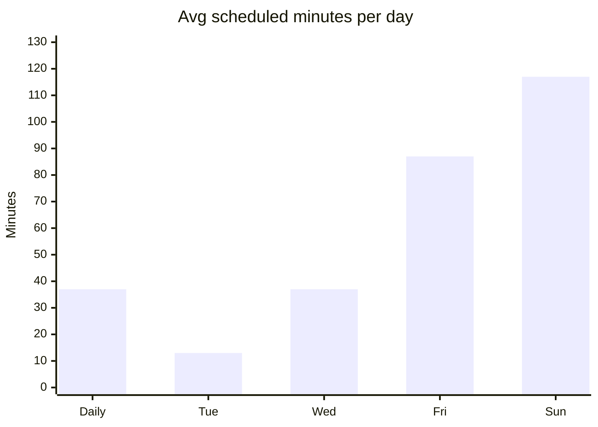

# Motivation

Weekdays are intense enough that nothing gets done outside of work, so chores, admin, and errands accumulate until Saturday. By the time Saturday arrives there's a long list and no energy, leaving the weekend feeling like an extension of the working week rather than a reset.

The goal is to redistribute the chore load across weekday evenings and mornings so that Saturday and Sunday are genuinely free — available for rest, socialising, and things worth looking forward to.

# Approach

## 1. Audit Current Load

Before changing anything, understand what's actually accumulating:

- List every recurring chore/task and its current default day
- Identify which ones are Saturday-locked (e.g. tip run, deep cleans) vs. flexible
- Estimate time per task
- Note which tasks depend on Chloe or on shared time

## 2. Design a Weekday Rhythm

Assign lightweight tasks to specific evenings based on effort and context:

| Evening | Slot | Type of task |
|---------|------|-------------|
| Monday | 20 min | Admin (email, messages, small to-dos) |
| Tuesday | 20 min | House (one room tidy, quick hoover) |
| Wednesday | Rest | Nothing scheduled |
| Thursday | 30 min | Prep (laundry started, shopping, meal prep) |
| Friday | 20 min | Wrap-up (clear inbox, plan weekend) |

## 3. Define a Protected Weekend

Decide what Saturday and Sunday are *for*:

- Saturday morning: free / exercise / social
- Saturday afternoon: one optional larger task if genuinely needed (not default)
- Sunday: fully protected — rest, relationships, cooking, outdoors

## 4. Update TickTick

Move tasks from the "Saturday" default into weekday slots in TickTick routines.

## 5. Review After One Sprint

After one full sprint, check: did it work? What slipped back to Saturday? Adjust.

# Actions

- Audit all recurring chores and their current day assignment
- Estimate time per task
- Draft weekday evening rhythm and share with Chloe
- Identify tasks that are genuinely Saturday-only (tip, big shop)
- Define what a "protected weekend" looks like in practice
- Update TickTick routines to reflect new distribution
- Add a sprint goal to trial the new rhythm for one sprint
- Review after one sprint and adjust

# Schedule

Bar length represents average recorded time (in minutes). Tasks marked *(monthly)*, *(bi-weekly)*, or *(quarterly)* don't appear every week.

Bar width = average duration. White = weekly, blue = bi-weekly, red = monthly or less frequent.

```mermaid
gantt
    title Recurring Task Schedule (x-axis = minutes)
    dateFormat X
    axisFormat %s
    tickInterval 30second

    section Daily
    Clean kitchen :0, 18
    Tidy :18, 34
    Clean bowls :34, 37

    section Tuesday
    Water plants :0, 13

    section Wednesday
    Shave :0, 12
    Take out bins :12, 20
    Water plants :20, 33
    Refill dry food :33, 37

    section Friday
    Hoover :0, 20
    Laundry :20, 34
    Water outdoor plants :34, 42
    Water plants :42, 55
    Take out bins :55, 63
    Clip nails :63, 72
    Clean email :crit, 72, 100
    Update dashboards :crit, 100, 114
    Submit meter readings :crit, 114, 118
    Update energy forecast :crit, 118, 163

    section Sunday
    Shave :0, 12
    Charge devices :12, 16
    Phone parents :16, 47
    Change bedding :active, 47, 61
    Sprint planning :active, 61, 88
    Clean bathroom :active, 88, 114
    Clean coffee machine :active, 114, 151
    Deep clean kitchen :crit, 151, 171
    Dust :crit, 171, 221
```

Weekly load by day (typical week — bi-weekly and monthly tasks averaged across occurrences):

# Log

## 2026-05-02

- Audited average chore durations using TickTick focus session data from the past 3 months (Feb–May 2026). Methodology: fetched focus records via TickTick API, extracted tasks matching chore names, calculated `(endTime - startTime)` per session, then averaged across all sessions per task. Results:
- Decided to put more regular events on a Friday in the hope that I can do it during work / lunch
- Settled on a two-tier weekend rhythm for recurring tasks:
	- **Friday** = "floor" tasks — things that would feel depressing if left undone going into the weekend (laundry piling up, hoovering not done). These are weekly.
	- **Sunday** = "deferrable" tasks — longer tasks (clean bathroom, clean coffee machine, deep clean kitchen, dust) that can slip into the following week without causing stress. Monthly and bi-weekly cadences preferred here.
	- Monthly/bi-weekly tasks were spread across the calendar to avoid any single week feeling heavy
- Expanded the analysis to cover all recurring tasks (any task appearing 3+ times in focus records), grouped by category:

**Chores**

| Task                 | Avg time | Sessions | Schedule            |
| -------------------- | -------- | -------- | ------------------- |
| Dust                 | 50 min   | 1        | 2nd Sunday of month |
| Clean coffee machine | 37 min   | 2        | Bi-weekly Sunday    |
| Clean bathroom       | 26 min   | 6        | Bi-weekly Sunday    |
| Deep clean kitchen   | 20 min   | 2        | 1st Sunday of month |
| Hoover               | 20 min   | 11       | Every Friday        |
| Clean kitchen        | 18 min   | 79       | Daily               |
| Tidy                 | 16 min   | 55       | Daily               |
| Laundry              | 14 min   | 34       | Every Friday        |
| Change bedding       | 14 min   | 5        | Bi-weekly Sunday    |
| Water plants         | 13 min   | 7        | Tuesday + Friday    |
| Take out bins        | 8 min    | 20       | Wednesday + Friday  |
| Water outdoor plants | 8 min    | 1        | Every Friday        |

**Personal care**

| Task | Avg time | Sessions | Schedule |
|------|----------|----------|----------|
| Shave | 12 min | 15 | Wednesday + Sunday |
| Clip nails | 9 min | 12 | Every Friday |
| Personal Care | 15 min | 2 | — |

**Admin & digital**

| Task                    | Avg time | Sessions | Schedule             |
| ----------------------- | -------- | -------- | -------------------- |
| Clear Slack saved items | 35 min   | 7        | —                    |
| Clean email             | 28 min   | 6        | Last Friday of month |
| Planning session        | 27 min   | 8        | —                    |
| Update dashboards       | 14 min   | 4        | Last Friday of month |
| Submit Meter Readings   | 4 min    | 3        | 1st Friday of month  |

**Wellbeing & social**

| Task | Avg time | Sessions | Schedule |
|------|----------|----------|----------|
| Reading | 45 min | 11 | — |
| Call parents | 31 min | 4 | Every Sunday |
| Exercise | 73 min | 2 | — |

**Work routines** *(included for completeness — not candidates for redistribution)*

| Task | Avg time | Sessions | Schedule |
|------|----------|----------|----------|
| Dev | 73 min | 21 | — |
| Scoping | 73 min | 15 | — |
| Code reviews | 53 min | 18 | Weekdays (habit) |
| Prepare PR | 61 min | 16 | — |
| Dev - Respond to Code Review | 25 min | 5 | — |
| Consumer Portal team standup | 14 min | 4 | — |
| TR - 1:1 | 34 min | 7 | — |

## 2026-05-01

- Project created following a pattern noticed in Sprint 26.09: intense weekdays leave all chores for Saturday, resulting in exhaustion and no headroom to enjoy the weekend
